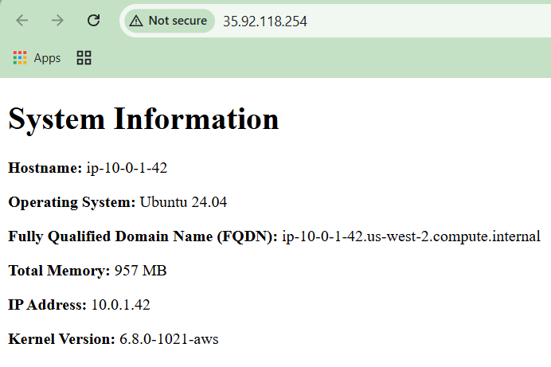

# 4640-w7-lab-start-w25

### **Generate ssh key**
```sh
ssh-keygen -t ed25519 -f ~/.ssh/aws -C "lab7 aws key"
```
### **Check ansible syntax**
```sh
ansible-playbook --check-syntax playbook.yml
```

### **Apply playbook to inventory**
```sh
ansible-playbook playbook.yml
```

### Screenshot of node

